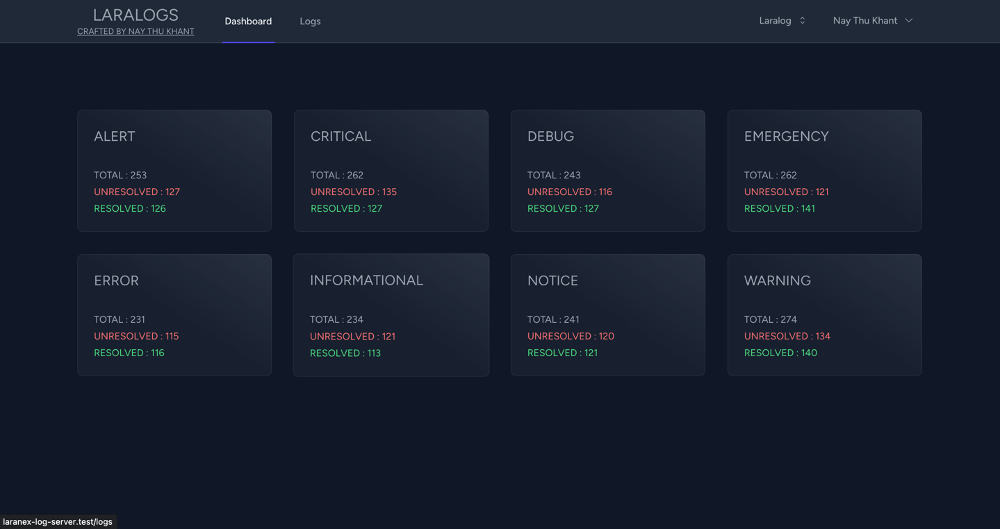
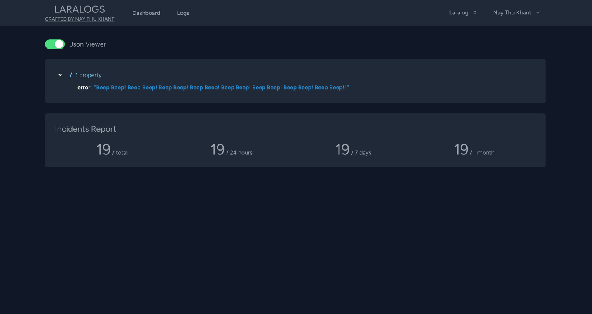

# Laralog

A Log Server implementation in Laravel. This server implementation is compatible with all kind of languages, you can simply call the API to store or report your application log

### installation

```
git clone git@github.com:NayThuKhant/laralog.git
composer install
cp .env.example .env
php artisan key:generate
php artisan db:seed 
npm install && npm run local
```





### Client Plugins

[Client package for Laravel](https://packagist.org/packages/laranex/laralog-client)

### If you don't want to use our supported plugins, you can simply call the API via your preferred http client.


