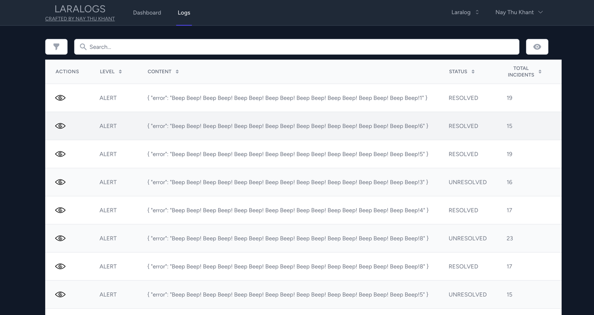

# Laralog

### installation

```
git clone git@github.com:NayThuKhant/laralog.git
cp .env.example .env
php artisan key:generate
composer install
php artisan db:seed 
npm install && npm run local
```





